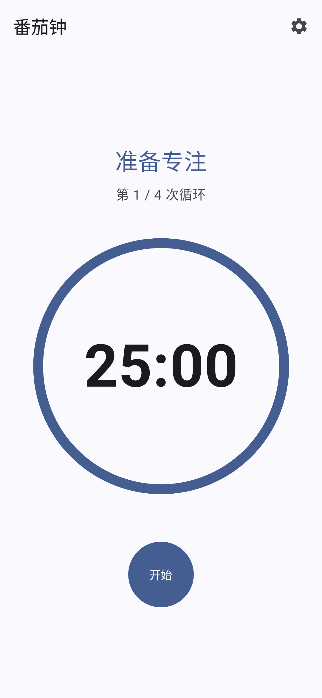
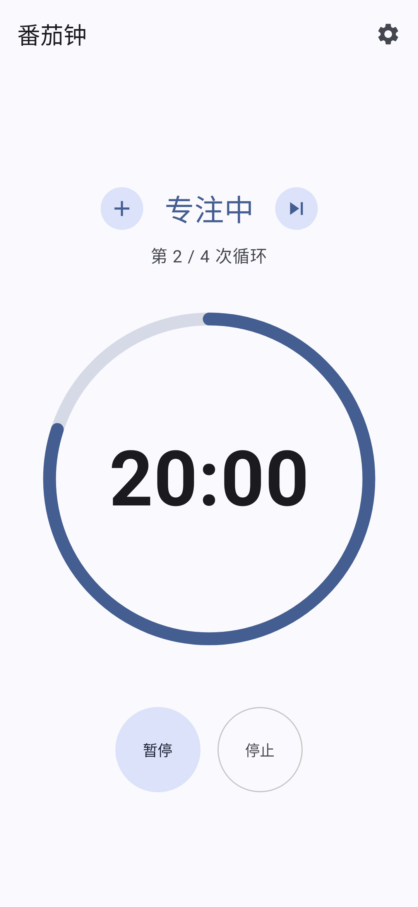
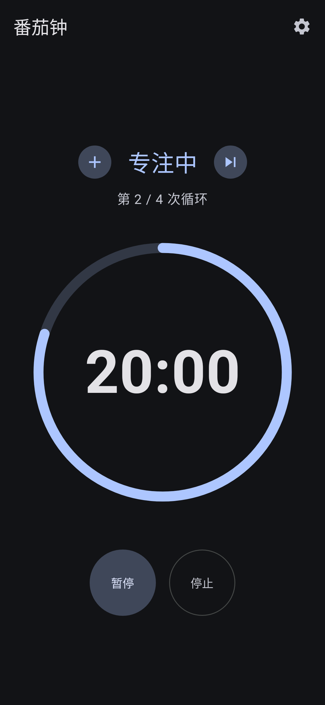
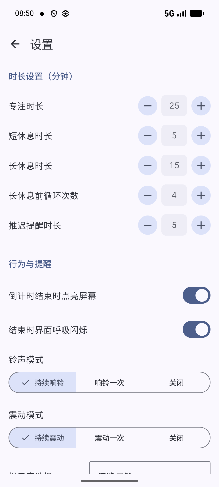

  

<h1 align="center">TomatoClock (番茄钟)</h1>

  
  
  
  

[English](#english) | [中文](#中文)

---

<h2 id="english">🇬🇧 English</h2>

**TomatoClock** is a modern Android Pomodoro Timer application built with Kotlin, Jetpack Compose, and Hilt. It features a stunning Material 3 design and guarantees zero-latency, highly accurate alarms even under deep sleep scenarios (Doze mode) or process death.

### 📸 Screenshots

  
  
  
  

### ✨ Features

*   **Customizable Timers**: Set custom durations for Focus, Short Break, and Long Break. +/- buttons support long-press for fast continuous adjustment.
*   **Quick Actions**: Add 5 minutes to the current timer or skip the current phase entirely during an active countdown.
*   **Independent Notifications**: Separately configure Sound Mode and Vibration Mode (Continuous, Once, or Off).
*   **Cycles**: Automatically track your pomodoro cycles and trigger a long break after a set number of focuses.
*   **Real-time Settings Sync**: Home screen instantly reflects changes made in Settings while the timer is idle.
*   **Postpone Reminder**: Postpone a completed session to continue for a few more minutes.
*   **Data Persistence & Recovery**: Features a **Write-Through** persistence strategy with an additional 60-second heartbeat. The app accurately recovers timer states even if the process is killed by the system.
*   **Pure Chinese UI**: The user interface is completely in Simplified Chinese (Bilingual support coming soon).

### 🚀 Getting Started

1.  Clone the repository.
2.  Open in Android Studio (Jellyfish or newer recommended).
3.  Ensure you have JDK 17 configured (`jvmToolchain(17)`).
4.  Sync Gradle and run the `app` configuration on an emulator or device.

*For detailed technical requirements, architecture, and testing guidelines, please see [REQUIREMENTS.md](REQUIREMENTS.md).*

### 🤝 Contribution & Feedback
Feel free to submit Issues or Pull Requests! Please read our [CONTRIBUTING.md](CONTRIBUTING.md) and [CODE_OF_CONDUCT.md](CODE_OF_CONDUCT.md) before contributing.

> **🤖 AI-Generated Project & Disclaimer**  
> This project was entirely generated by AI coding assistants. While the code has been structured to function as described, it is provided "AS IS". Users are responsible for verifying the security, stability, and suitability of this software for their specific environments. The authors and AI providers assume no liability for any data loss, security breaches, or system issues resulting from its use.

### 📜 License
This project is licensed under the **GNU General Public License v3.0 (GPLv3)**.

---

<h2 id="中文">🇨🇳 中文</h2>

**TomatoClock (番茄钟)** 是一款使用 Kotlin、Jetpack Compose 和 Hilt 构建的现代 Android 番茄钟应用。它采用 Material 3 设计规范，并通过可靠的系统级调度，保证即使在深度休眠 (Doze 模式) 或进程被杀的情况下，也能实现零延迟、高精度的闹钟提醒。

### 📸 截图预览

  
  
  
  

### ✨ 核心功能

*   **自定义时长**: 支持分别设置专注、短休息和长休息的时长。增减按钮支持长按连续快速调节。
*   **快捷操作**: 在倒计时进行中，支持“加5分钟”与“跳过当前周期”功能。
*   **独立通知设置**: 独立配置铃声与震动模式，支持持续、单次或关闭。
*   **智能循环**: 自动记录您的番茄钟循环次数，并在设定的专注次数后自动触发长休息。
*   **设置实时同步**: 在计时器空闲状态下，设置页面的修改会即时反映在主界面上。
*   **推迟提醒**: 当阶段结束时，您可以推迟几分钟再进入下一阶段。
*   **极致数据持久化**: 采用直写式持久化策略，每次状态变更立即落盘，并在倒计时期间以 60 秒心跳兜底，在异常杀后台后仍能准确恢复计时状态。
*   **纯中文界面**: 用户界面为纯正的简体中文设计。

### 🚀 快速开始

1.  克隆本仓库到本地。
2.  使用 Android Studio (推荐 Jellyfish 及以上版本) 打开项目。
3.  确保您的环境已配置 JDK 17 (`jvmToolchain(17)`)。
4.  同步 Gradle 后，在模拟器或真机上运行 `app` 配置。

*有关详细的技术栈说明、架构规范及测试指南，请参阅 [REQUIREMENTS.md](REQUIREMENTS.md) 文档。*

### 🤝 参与贡献与反馈
欢迎提交 Issue 或 Pull Request！在贡献代码前，请仔细阅读 [贡献指南 (CONTRIBUTING.md)](CONTRIBUTING.md) 和 [行为规范 (CODE_OF_CONDUCT.md)](CODE_OF_CONDUCT.md)。

> **🤖 AI 辅助项目免责声明**  
> 本项目由 AI 编程助手全自动生成。虽然代码已按预期功能进行了结构化和编写，但按“原样”提供。用户应自行验证此软件在特定环境下的安全性、稳定性和适用性。作者和 AI 提供商对因使用本软件导致的任何数据丢失、安全漏洞或系统问题不承担任何责任。

### 📜 开源协议
本项目采用 **GNU General Public License v3.0 (GPLv3)** 开源协议。
